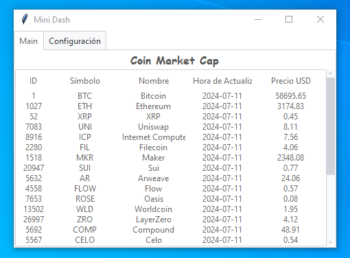
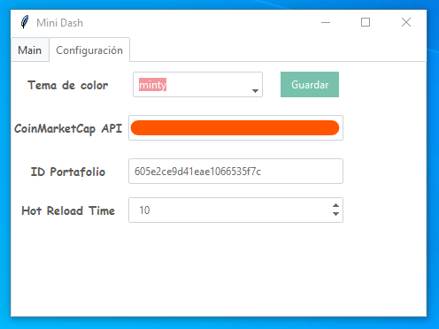

# Coin-Py

Una mini herramienta usando la API de CoinMarketCap para ver el precio de las criptomonedas.

## Dependencias
* `ttkbootstrap`
* `requests`
* `tkinter`

## Para utilizar este programa

1. Instalar pipenv:
    ```bash
    pip install pipenv
    ```

2. Clonar el repositorio y entrar en él:
    ```bash
    git clone https://github.com/BAA4TS/Coin-Py
    cd Coin-Py
    ```

3. Crear el entorno y las dependencias:
    ```bash
    pipenv shell
    pipenv install
    ```

4. Registrarse en [CoinMarketCap](https://coinmarketcap.com/api/).

5. Ir a la sección de API, copiar el token y pegarlo en la configuración. Luego darle al botón guardar.



